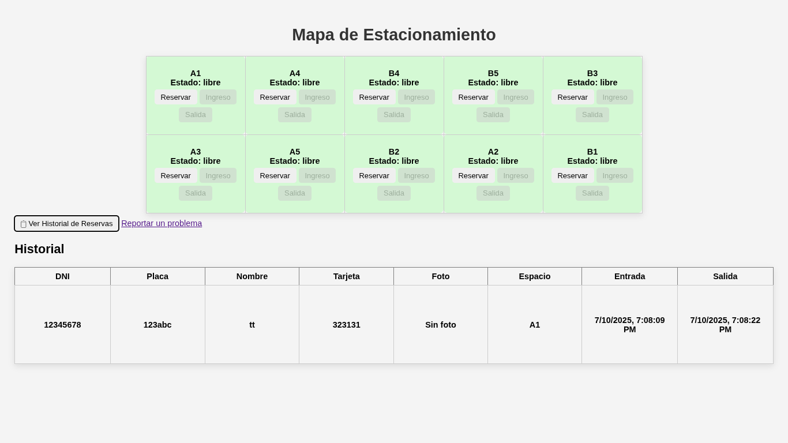

# Estacionamiento Smart (Simulación)

Proyecto simulado para gestión de estacionamiento con:
- Reservas de espacio
- Mapeo visual
- Conexión a msSQL `server-msSql.js` o sqlite `sqlite.js`
- msSql - Simulación en Tinkercad (fuera del alcance del código)
- db backup: db/Estacionamiento
- sqlite crea parking.db



## Cómo iniciar

1. Instala dependencias:
```bash
npm install
```

- mssql connection: `npm i mssql`
- sqlite connection: `npm i sqlite3`
- json storage (no dependencies): `npm run json-dn`
- js object: npm run obc-js

2. Configura la base de datos mssql en `.env`

3. Ejecuta el servidor:
```bash
npm run sqlite | mssql
```
